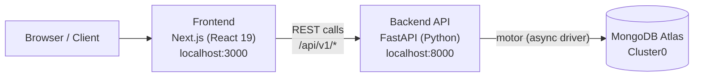

# System Architecture

High-level view of how Handpikd Revmap's pieces fit together: the client, the two deployable services, and the data store.

## Overview

## Components

| Component | Tech | Location | Responsibility |
|---|---|---|---|
| Frontend | Next.js 16 (App Router), React 19, TypeScript, Tailwind CSS 4 | `frontend/` | Renders UI, calls the backend REST API |
| Backend | FastAPI, Uvicorn, Pydantic Settings | `backend/` | Exposes REST API, owns business logic, talks to MongoDB |
| Database | MongoDB Atlas (Cluster0), accessed via `motor` (async) | External (cloud) | Persists application data |

## Environments & configuration

Each service owns its own `.env` file (gitignored) loaded via `pydantic-settings` (backend) and Next.js env conventions (frontend):

- `backend/.env` — `DEBUG`, `MONGODB_URI`, `MONGODB_DB_NAME`
- `frontend/.env` — frontend-facing config (e.g. API base URL, once introduced)

## Network / request flow

1. Browser loads the Next.js app (`frontend`).
2. Client-side code issues HTTP requests to the FastAPI backend under `/api/v1/*`.
3. FastAPI's CORS middleware (currently `allow_origins=["*"]`) permits the browser to call the API cross-origin during development.
4. FastAPI handlers use the Motor client (initialized once at app startup via a `lifespan` hook, see `backend/app/core/db.py`) to read/write MongoDB Atlas.

## Deployment topology (current)

Both services run locally today:

- Backend: `uvicorn app.main:app --reload` → `http://localhost:8000` (docs at `/docs`)
- Frontend: `next dev` → `http://localhost:3000`
- Database: MongoDB Atlas, managed cloud cluster (no local DB)

There is no reverse proxy, container orchestration, or CI/CD wired up yet — this section should be updated once a real deployment target (e.g. Vercel for frontend, a container host for backend) is chosen.

## Related documents

- [APPLICATION_ARCHITECTURE.md](APPLICATION_ARCHITECTURE.md) — internal structure of each codebase
- [PAGE_API_ARCHITECTURE.md](PAGE_API_ARCHITECTURE.md) — concrete pages and API endpoints
